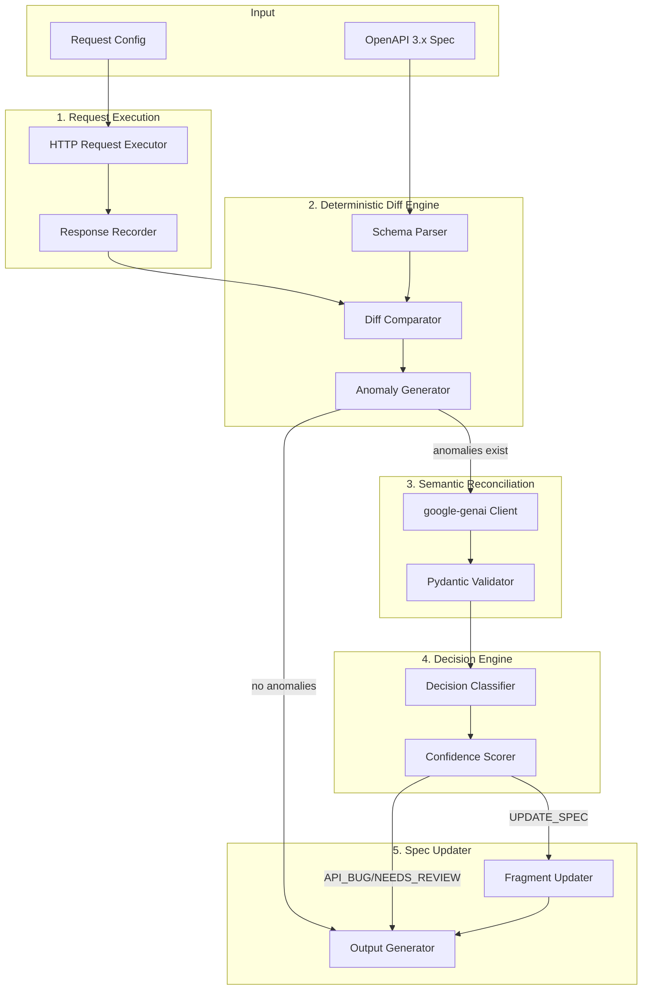

# SpecDrift Agent - Implementation Plan

An autonomous agent that detects and reconciles drift between real API behavior and OpenAPI 3.x specifications.

## Architecture Overview



---

## Proposed Changes

### Phase 1: Project Setup

#### [NEW] [pyproject.toml](file:///c:/Users/saikr/source/repos/spec_drift_agent/pyproject.toml)
- Python 3.11+ project configuration
- Dependencies: `google-genai`, `httpx`, `pyyaml`, `jsonschema`, `pydantic`, `typer`
- Dev: `pytest`, `pytest-asyncio`, `mypy`, `ruff`

---

### Phase 2: Core Types

#### [NEW] [src/specdrift/types.py](file:///c:/Users/saikr/source/repos/spec_drift_agent/src/specdrift/types.py)
Core Pydantic models:
- `RequestConfig` - HTTP request configuration
- `RecordedResponse` - Captured API response
- `Anomaly` - Detected drift anomaly
- `AnomalySummary` - Aggregated anomalies
- `ChangeInstruction` - Proposed spec change
- `LLMDecision` - Structured LLM output (enforced schema)
- `DriftReport` - Final output

---

### Phase 3: Request Execution Module

#### [NEW] [src/specdrift/modules/request_executor.py](file:///c:/Users/saikr/source/repos/spec_drift_agent/src/specdrift/modules/request_executor.py)
- `async def execute_request(config: RequestConfig) -> RecordedResponse`
- Uses `httpx` for async HTTP
- Records: status, headers, body, timing
- No retry logic

---

### Phase 4: OpenAPI Parser

#### [NEW] [src/specdrift/modules/openapi_parser.py](file:///c:/Users/saikr/source/repos/spec_drift_agent/src/specdrift/modules/openapi_parser.py)
- `parse_spec(spec: str | dict) -> ParsedSpec`
- Extract schemas by path/method
- Resolve `$ref` references
- Cache resolved schemas

---

### Phase 5: Deterministic Diff Engine (NO LLM)

#### [NEW] [src/specdrift/modules/diff_engine/](file:///c:/Users/saikr/source/repos/spec_drift_agent/src/specdrift/modules/diff_engine/)

| File | Purpose |
|------|---------|
| `__init__.py` | `compare_response_to_schema()` main entry |
| `detectors/type_detector.py` | Type mismatches |
| `detectors/required_detector.py` | Missing required fields |
| `detectors/additional_detector.py` | Undocumented fields |
| `detectors/enum_detector.py` | Enum violations |
| `detectors/status_detector.py` | Status code mismatches |
| `anomaly_summarizer.py` | Aggregate anomalies |

---

### Phase 6: Semantic Reconciliation (LLM-backed)

#### [NEW] [src/specdrift/modules/semantic_reconciler/](file:///c:/Users/saikr/source/repos/spec_drift_agent/src/specdrift/modules/semantic_reconciler/)

| File | Purpose |
|------|---------|
| `__init__.py` | `async def reconcile()` main entry |
| `prompt_builder.py` | Build structured prompts |
| `llm_client.py` | `google-genai` integration with Pydantic structured output |
| `output_validator.py` | Validate against `LLMDecision` schema |

**Key**: Uses `google-genai` SDK's native structured output with Pydantic models for guaranteed schema compliance.

---

### Phase 7: Decision Engine

#### [NEW] [src/specdrift/modules/decision_engine.py](file:///c:/Users/saikr/source/repos/spec_drift_agent/src/specdrift/modules/decision_engine.py)
- Apply confidence threshold (>0.85 for auto-update)
- Classify: `UPDATE_SPEC`, `API_BUG`, `NEEDS_REVIEW`

---

### Phase 8: Spec Updater

#### [NEW] [src/specdrift/modules/spec_updater.py](file:///c:/Users/saikr/source/repos/spec_drift_agent/src/specdrift/modules/spec_updater.py)
- `apply_updates(spec, changes) -> UpdatedSpec`
- Use `jsonpath-ng` for precise updates
- Preserve YAML formatting

---

### Phase 9: CLI Interface

#### [NEW] [src/specdrift/cli.py](file:///c:/Users/saikr/source/repos/spec_drift_agent/src/specdrift/cli.py)
- Built with `typer`
- Commands: `analyze`, `validate`
- Supports: `--spec`, `--endpoint`, `--output`

---

### Phase 10: FastAPI Test API (Dogfooding)

#### [NEW] [test_api/](file:///c:/Users/saikr/source/repos/spec_drift_agent/test_api/)

A FastAPI application with **intentional spec drift** scenarios to test the agent.

| File | Purpose |
|------|---------|
| `main.py` | FastAPI app with drifted endpoints |
| `openapi_spec.yaml` | The "official" spec (intentionally out-of-sync) |
| `scenarios.md` | Documents each drift scenario |

**Built-in Drift Scenarios:**
1. **Extra field** - Response includes `metadata` not in spec
2. **Missing required** - `updated_at` sometimes null (spec says required)
3. **Enum violation** - `status` returns `"archived"` (not in spec enum)
4. **Type mismatch** - `count` returns string `"42"` instead of int
5. **Undocumented status** - Returns 422 (not documented)

```bash
# Run test API
cd test_api && uvicorn main:app --reload --port 8000

# Test specdrift against it
specdrift analyze --spec test_api/openapi_spec.yaml --endpoint http://localhost:8000
```

---

## Project Structure

```
spec_drift_agent/
├── pyproject.toml
├── src/
│   └── specdrift/
│       ├── __init__.py
│       ├── types.py
│       ├── cli.py
│       └── modules/
│           ├── request_executor.py
│           ├── openapi_parser.py
│           ├── diff_engine/
│           │   ├── __init__.py
│           │   ├── anomaly_summarizer.py
│           │   └── detectors/
│           │       ├── type_detector.py
│           │       ├── required_detector.py
│           │       ├── additional_detector.py
│           │       ├── enum_detector.py
│           │       └── status_detector.py
│           ├── semantic_reconciler/
│           │   ├── __init__.py
│           │   ├── prompt_builder.py
│           │   └── llm_client.py
│           ├── decision_engine.py
│           └── spec_updater.py
├── tests/
│   ├── unit/
│   │   └── test_diff_engine.py
│   └── integration/
│       └── test_pipeline.py
└── test_api/                    # Dogfooding API
    ├── main.py
    ├── openapi_spec.yaml
    └── scenarios.md
```

---

## Verification Plan

### Automated Tests
```bash
# Unit tests
pytest tests/unit -v

# Integration tests  
pytest tests/integration -v

# Type checking
mypy src/
```

### Manual CLI Test
```bash
# Install
pip install -e .

# Run analysis
specdrift analyze --spec examples/sample_spec.yaml --endpoint https://httpbin.org/json
```

---

## Key Dependencies

| Package | Version | Purpose |
|---------|---------|---------|
| `google-genai` | latest | Gemini API with structured output |
| `httpx` | ^0.27 | Async HTTP client |
| `pydantic` | ^2.0 | Type validation & LLM output schemas |
| `pyyaml` | ^6.0 | OpenAPI YAML parsing |
| `jsonschema` | ^4.0 | Schema validation |
| `typer` | ^0.12 | CLI framework |
