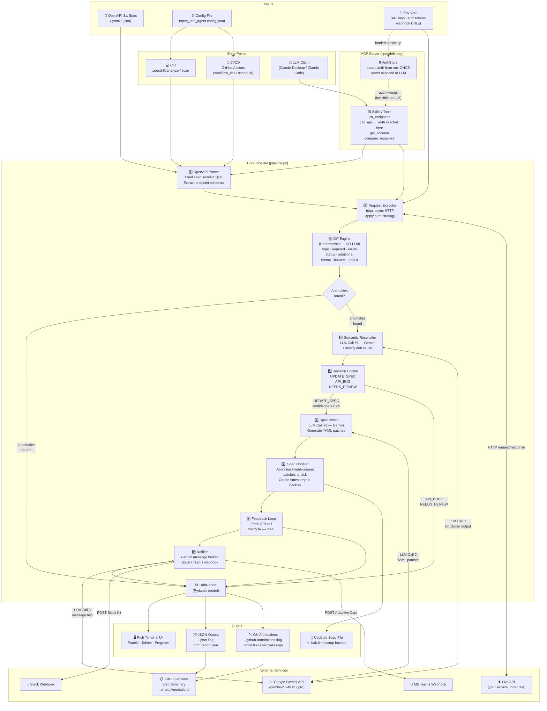

# SpecDrift Agent — Implementation Plan

## Architecture Diagram

### Full System Architecture (Target State)


```mermaid
flowchart TB
    %% ── Inputs ──────────────────────────────────────────────────────────────
    subgraph Input["Inputs"]
        SPEC["📄 OpenAPI 3.x Spec\n(.yaml / .json)"]
        CONFIG["⚙️ Config File\n(spec_drift_agent.config.json)"]
        ENV["🔑 Env Vars\n(API keys, auth tokens,\nwebhook URLs)"]
    end

    %% ── Entry Points ─────────────────────────────────────────────────────────
    subgraph Entry["Entry Points"]
        CLI["💻 CLI\nspecdrift analyze / scan"]
        CICD["🔄 CI/CD\nGitHub Actions\n(workflow_call / schedule)"]
        MCP_CLIENT["🤖 LLM Client\n(Claude Desktop / Claude Code)"]
    end

    %% ── MCP Layer ────────────────────────────────────────────────────────────
    subgraph MCP_LAYER["MCP Server  (specdrift mcp)"]
        AUTH_STORE["🔒 AuthStore\nLoads auth from env ONCE\nNever exposed to LLM"]
        MCP_TOOLS["🛠️ Skills / Tools\nlist_endpoints\ncall_api  ← auth injected here\nget_schema\ncompare_response"]
    end

    %% ── Core Pipeline ────────────────────────────────────────────────────────
    subgraph Pipeline["Core Pipeline  (pipeline.py)"]
        direction TB
        P1["1️⃣  OpenAPI Parser\nLoad spec, resolve \$ref\nExtract endpoint schemas"]
        P2["2️⃣  Request Executor\nhttpx async HTTP\nApply auth strategy"]
        P3["3️⃣  Diff Engine\n(Deterministic — NO LLM)\ntype · required · enum\nstatus · additional\nformat · bounds · oneOf"]
        P4{Anomalies\nfound?}
        P5["4️⃣  Semantic Reconciler\nLLM Call #1 — Gemini\nClassify drift cause"]
        P6["5️⃣  Decision Engine\nUPDATE_SPEC\nAPI_BUG\nNEEDS_REVIEW"]
        P7["6️⃣  Spec Writer\nLLM Call #2 — Gemini\nGenerate YAML patches"]
        P8["7️⃣  Spec Updater\nApply backward-compat\npatches to disk\nCreate timestamped backup"]
        P9["8️⃣  Feedback Loop\nFresh API call\nVerify fix — ✅/⚠️"]
        P10["9️⃣  Notifier\nGemini message builder\nSlack / Teams webhook"]
        REPORT["📊 DriftReport\n(Pydantic model)"]
    end

    %% ── External Services ────────────────────────────────────────────────────
    subgraph External["External Services"]
        GEMINI["✨ Google Gemini API\n(gemini-2.5-flash / pro)"]
        LIVE_API["🌐 Live API\n(your service under test)"]
        SLACK["💬 Slack Webhook"]
        TEAMS["💼 MS Teams Webhook"]
        GH_ACTIONS["📋 GitHub Actions\nStep Summary\n::error:: Annotations"]
    end

    %% ── Output ───────────────────────────────────────────────────────────────
    subgraph Output["Output"]
        RICH["🖥️ Rich Terminal UI\nPanels · Tables · Progress"]
        JSON_OUT["📦 JSON Output\n--json flag\ndrift_report.json"]
        SPEC_FILE["📝 Updated Spec File\n+ .bak.timestamp backup"]
        ANNOTATIONS["🏷️ GH Annotations\n--github-annotations flag\n::error file=spec::message"]
    end

    %% ── Connections: Entry → Pipeline ────────────────────────────────────────
    CLI --> P1
    CICD --> P1
    MCP_CLIENT --> MCP_TOOLS
    AUTH_STORE -.->|"auth kwargs\n(invisible to LLM)"| MCP_TOOLS
    MCP_TOOLS --> P1
    MCP_TOOLS --> P2
    ENV -.->|"loaded at startup"| AUTH_STORE

    %% ── Connections: Input → Pipeline ────────────────────────────────────────
    SPEC --> P1
    CONFIG --> CLI
    CONFIG --> CICD
    ENV --> P2

    %% ── Pipeline flow ────────────────────────────────────────────────────────
    P1 --> P2
    P2 --> P3
    P3 --> P4
    P4 -->|"0 anomalies\nno drift"| REPORT
    P4 -->|"anomalies\nfound"| P5
    P5 --> P6
    P6 -->|"UPDATE_SPEC\nconfidence > 0.85"| P7
    P6 -->|"API_BUG /\nNEEDS_REVIEW"| REPORT
    P7 --> P8
    P8 --> P9
    P9 --> P10
    P9 --> REPORT
    P10 --> REPORT

    %% ── External service calls ───────────────────────────────────────────────
    P5 <-->|"LLM Call 1\nstructured output"| GEMINI
    P7 <-->|"LLM Call 2\nYAML patches"| GEMINI
    P10 <-->|"LLM Call 3\nmessage text"| GEMINI
    P2 <-->|"HTTP request/response"| LIVE_API
    P10 -->|"POST Block Kit"| SLACK
    P10 -->|"POST Adaptive Card"| TEAMS
    P8 --> SPEC_FILE

    %% ── Output connections ───────────────────────────────────────────────────
    REPORT --> RICH
    REPORT --> JSON_OUT
    REPORT --> ANNOTATIONS
    JSON_OUT --> GH_ACTIONS
    ANNOTATIONS --> GH_ACTIONS
```

---

### New Module Map (additions highlighted)

```
spec_drift_agent/
├── src/specdrift/
│   ├── types.py                  ← + FORMAT_VIOLATION, BOUNDS_VIOLATION
│   ├── cli.py                    ← + mcp command, --github-annotations
│   └── modules/
│       ├── pipeline.py           ← + notifications_config param, Step 12
│       ├── diff_engine/
│       │   └── detectors/
│       │       ├── type_detector.py     ← + oneOf/anyOf/allOf, format, bounds
│       │       └── required_detector.py ← + array bug fix, oneOf support
│       ├── notifier/             ← NEW
│       │   ├── __init__.py
│       │   ├── message_builder.py
│       │   ├── slack_notifier.py
│       │   └── teams_notifier.py
│       └── semantic_reconciler/  (unchanged)
├── mcp/                          ← NEW
│   ├── __init__.py
│   ├── auth_store.py             ← auth from env, never to LLM
│   └── server.py                 ← 4 MCP tools (stdio transport)
├── test_api/
│   ├── main.py                   ← + 9 new drift endpoints
│   └── openapi_spec.yaml         ← + 9 new spec entries
├── tests/
│   ├── unit/test_diff_engine.py  ← + TestTypeDetectorExtended, TestRequiredDetectorExtended
│   └── integration/
│       └── test_drift_scenarios.py ← NEW
├── .github/workflows/
│   └── spec-drift.yml            ← + workflow_call, step summary, exit codes
├── SKILLS.md                     ← NEW
└── IMPLEMENTATION_PLAN.md        ← this file
```

---

## Overview

Four improvement areas. Progress tracked via the checklist below.

---

## Progress Checklist

### Feature 1: Test Infrastructure

#### 1a. `src/specdrift/types.py`
- [ ] Add `FORMAT_VIOLATION = "FORMAT_VIOLATION"` to `AnomalyType`
- [ ] Add `BOUNDS_VIOLATION = "BOUNDS_VIOLATION"` to `AnomalyType`

#### 1b. `src/specdrift/modules/diff_engine/detectors/type_detector.py`
- [ ] Add `oneOf`/`anyOf`/`allOf` branch (before the `if schema_type is None: return []` early return)
- [ ] Add format validation (email, date-time, uuid) → emit `FORMAT_VIOLATION`
- [ ] Add numeric bounds validation (minimum/maximum/exclusiveMin/Max) → emit `BOUNDS_VIOLATION`
- [ ] Pass `_depth` through recursive calls to guard against infinite recursion (max depth 20)

#### 1c. `src/specdrift/modules/diff_engine/detectors/required_detector.py`
- [ ] Fix latent array traversal bug (unreachable `isinstance(value, list)` branch)
- [ ] Add `oneOf`/`anyOf` support — validate required fields against non-null sub-schema

#### 1d. `test_api/main.py` + `test_api/openapi_spec.yaml` + `test_api/scenarios.md`
- [ ] `GET /drift/array-type-mismatch` — spec: array of ints; drift: array of strings
- [ ] `GET /drift/nested-required` — spec: 3-level nested object; drift: level-3 required field missing
- [ ] `GET /drift/oneof-null` — spec: `oneOf [{type: string}, {type: null}]`; drift: returns integer
- [ ] `GET /drift/numeric-bounds` — spec: `score` with `maximum: 100`; drift: returns 150
- [ ] `GET /drift/format-violation` — spec: `email` with `format: email`; drift: returns "not-an-email"
- [ ] `GET /drift/empty-object` — spec: object with required fields; drift: returns `{}`
- [ ] `GET /drift/nested-extra-fields` — spec: clean nested object; drift: undocumented field inside nested
- [ ] `GET /drift/server-error` — always returns 503
- [ ] `GET /drift/5xx-error` — always returns 500
- [ ] Update `test_api/openapi_spec.yaml` with spec entries for all 9 endpoints
- [ ] Update `test_api/scenarios.md` documenting each scenario

#### 1e. `tests/unit/test_diff_engine.py`
- [ ] `TestTypeDetectorExtended` — oneOf null/string, format email/datetime, bounds violations, empty array, array of objects type mismatch
- [ ] `TestRequiredDetectorExtended` — 3-level nested missing field, oneOf required validation, required in array items

#### 1f. `tests/integration/test_drift_scenarios.py` (new file)
- [ ] Test for each of the 9 new endpoints: no-drift path (0 anomalies) + drift path (correct anomaly type)
- [ ] 5xx status code mismatch test

---

### Feature 2: CI/CD Improvements

#### `.github/workflows/spec-drift.yml`
- [ ] Add `workflow_call` trigger with inputs: `fail_on_drift`, `config_path`, `update_spec`, `model`
- [ ] Fix `|| true` — store exit code explicitly, apply `fail_on_drift` gate
- [ ] Add GitHub Actions step summary (inline Python, writes markdown table to `$GITHUB_STEP_SUMMARY`)

#### `src/specdrift/cli.py`
- [ ] Add `--github-annotations` flag to `analyze` command
- [ ] Add `--github-annotations` flag to `scan` command
- [ ] Add `_output_github_annotations(report)` function (emits `::error::` lines)

#### `README.md`
- [ ] Add "Using in CI" section with workflow_call snippet, inputs table, secrets, exit code contract

---

### Feature 3: Notifications (Slack + Teams)

#### New files in `src/specdrift/modules/notifier/`
- [ ] `__init__.py` — `send_notification(report, config)` orchestrator
- [ ] `message_builder.py` — Gemini call with sanitized DriftReport fields, returns 2-3 line message string
- [ ] `slack_notifier.py` — POST to Slack webhook (Block Kit); webhook URL never logged
- [ ] `teams_notifier.py` — POST to Teams webhook (Adaptive Card v1.4); webhook URL never logged

#### `src/specdrift/modules/pipeline.py`
- [ ] Add `notifications_config: dict | None = None` param to `analyze_endpoint()`
- [ ] Add Step 12 after feedback loop: call notifier in try/except (notification failure never fails pipeline)

#### `src/specdrift/cli.py`
- [ ] Extract `config_data.get("notifications")` and pass to `analyze_endpoint()` in `analyze` command
- [ ] Extract `config_data.get("notifications")` and pass to `analyze_endpoint()` in `scan` command
- [ ] In `scan` exception handler: add error notification with synthetic context

#### `spec_drift_agent.config.example.json`
- [ ] Add `notifications` section with Slack and Teams examples

---

### Feature 4: MCP Server + Skills

#### New files in `src/specdrift/mcp/`
- [ ] `__init__.py`
- [ ] `auth_store.py` — `AuthStore` class: loads all auth from env at startup, `get_request_kwargs()`, never exposes to LLM
- [ ] `server.py` — MCP server (stdio), 4 tools: `list_endpoints`, `call_api`, `get_schema`, `compare_response`; auth injected via `_auth_store` closure, never from tool arguments

#### `src/specdrift/cli.py`
- [ ] Add `mcp` subcommand: `--base-url`, `--env-file`; graceful ImportError message if `mcp` extra not installed; console to stderr before starting server

#### `pyproject.toml`
- [ ] Add `mcp = ["mcp>=1.0.0"]` optional dependency group

#### `SKILLS.md` (new file at repo root)
- [ ] Document each skill: name, description, input schema, example usage
- [ ] "How to add a new skill" section with step-by-step template
- [ ] Security rules: auth fields never in inputSchema, always injected via AuthStore

#### `CLAUDE.md`
- [ ] Add "MCP Server" section: how to start, Claude Desktop config, tools table, auth security invariant

---

## Security Rules (non-negotiable)

1. **Webhook URLs** — always via `${ENV_VAR}` in config; resolved before reaching notifier; never logged; never in LLM prompts
2. **Auth tokens** — only loaded from env vars; never in LLM prompts; in MCP, only loaded by `auth_store.py` at server startup
3. **MCP tool schemas** — must NOT include `auth_token`, `api_key`, `client_secret`, or any auth field
4. **Notification LLM prompt** — only sees: `endpoint`, `decision`, `anomaly_count`, `notes_for_humans`, `spec_updated`, `fix_verified`

---

## Implementation Order

```
types.py (1a)
  ↓
type_detector.py (1b) + required_detector.py (1c)
  ↓
test_api endpoints (1d)
  ↓
unit tests (1e) + integration tests (1f)
  ↓
spec-drift.yml + cli.py annotations (Feature 2)
  ↓
notifier/ package (3a-d) → pipeline.py (3e) → cli.py wiring (3f)
  ↓
mcp/ package (4a) → cli.py mcp command (4b) → pyproject.toml (4c)
  ↓
SKILLS.md + CLAUDE.md + README.md docs
```

---

## Verification Commands

```bash
# Feature 1
pytest tests/unit -v
pytest tests/integration/test_drift_scenarios.py -v

# Feature 2
python -c "import yaml; yaml.safe_load(open('.github/workflows/spec-drift.yml'))"
specdrift scan --config spec_drift_agent.config.json --github-annotations

# Feature 3 (set SLACK_WEBHOOK_URL or TEAMS_WEBHOOK_URL in .env)
specdrift scan --config spec_drift_agent.config.json

# Feature 4
pip install -e ".[mcp]"
specdrift mcp --base-url http://localhost:8000
```
